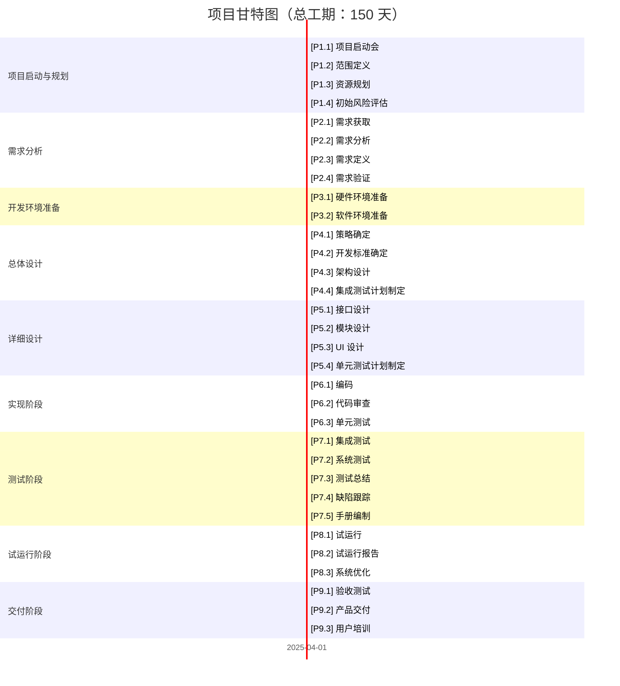

```mermaid
gantt
    title 项目甘特图（总工期：150 天）
    dateFormat  YYYY-MM-DD
    section 项目启动与规划
    [P1.1] 项目启动会         :P1_1, 2025-04-01, 5d     % ES:0 EF:5 LS:0 LF:5 TF:0 FF:0
    [P1.2] 范围定义           :P1_2, after P1_1, 3d    % ES:5 EF:8 LS:5 LF:8 TF:0 FF:0
    [P1.3] 资源规划           :P1_3, after P1_2, 5d    % ES:8 EF:13 LS:8 LF:13 TF:0 FF:0
    [P1.4] 初始风险评估       :P1_4, after P1_3, 4d    % ES:13 EF:17 LS:13 LF:17 TF:0 FF:0

    section 需求分析
    [P2.1] 需求获取           :crit, P2_1, after P1_4, 10d   % ES:17 EF:27 LS:17 LF:27 TF:0 FF:0
    [P2.2] 需求分析           :crit, P2_2, after P2_1, 8d    % ES:27 EF:35 LS:27 LF:35 TF:0 FF:0
    [P2.3] 需求定义           :crit, P2_3, after P2_2, 7d    % ES:35 EF:42 LS:35 LF:42 TF:0 FF:0
    [P2.4] 需求验证           :crit, P2_4, after P2_3, 5d    % ES:42 EF:47 LS:42 LF:47 TF:0 FF:0

    section 开发环境准备
    [P3.1] 硬件环境准备       :P3_1, after P2_4, 6d    % ES:47 EF:53 LS:55 LF:61 TF:8 FF:0
    [P3.2] 软件环境准备       :P3_2, after P3_1, 9d    % ES:53 EF:62 LS:61 LF:70 TF:8 FF:0

    section 总体设计
    [P4.1] 策略确定           :crit, P4_1, after P2_4, 7d    % ES:47 EF:54 LS:47 LF:54 TF:0 FF:0
    [P4.2] 开发标准确定       :crit, P4_2, after P4_1, 5d    % ES:54 EF:59 LS:54 LF:59 TF:0 FF:0
    [P4.3] 架构设计           :crit, P4_3, after P4_2, 10d   % ES:59 EF:69 LS:59 LF:69 TF:0 FF:0
    [P4.4] 集成测试计划制定   :crit, P4_4, after P4_3, 4d    % ES:69 EF:73 LS:69 LF:73 TF:0 FF:0

    section 详细设计
    [P5.1] 接口设计           :crit, P5_1, after P4_4, 6d    % ES:73 EF:79 LS:73 LF:79 TF:0 FF:0
    [P5.2] 模块设计           :crit, P5_2, after P5_1, 8d    % ES:79 EF:87 LS:79 LF:87 TF:0 FF:0
    [P5.3] UI 设计            :crit, P5_3, after P5_2, 10d   % ES:87 EF:97 LS:87 LF:97 TF:0 FF:0
    [P5.4] 单元测试计划制定   :crit, P5_4, after P5_3, 4d    % ES:97 EF:101 LS:97 LF:101 TF:0 FF:0

    section 实现阶段
    [P6.1] 编码               :crit, P6_1, after P5_4, 20d   % ES:101 EF:121 LS:101 LF:121 TF:0 FF:0
    [P6.2] 代码审查           :crit, P6_2, after P6_1, 5d    % ES:121 EF:126 LS:121 LF:126 TF:0 FF:0
    [P6.3] 单元测试           :crit, P6_3, after P6_2, 5d    % ES:126 EF:131 LS:126 LF:131 TF:0 FF:0

    section 测试阶段
    [P7.1] 集成测试           :crit, P7_1, after P6_3, 6d    % ES:131 EF:137 LS:131 LF:137 TF:0 FF:0
    [P7.2] 系统测试           :crit, P7_2, after P7_1, 8d    % ES:137 EF:145 LS:137 LF:145 TF:0 FF:0
    [P7.3] 测试总结           :crit, P7_3, after P7_2, 3d    % ES:145 EF:148 LS:145 LF:148 TF:0 FF:0
    [P7.4] 缺陷跟踪           :crit, P7_4, after P7_3, 3d    % ES:148 EF:151 LS:148 LF:151 TF:0 FF:0
    [P7.5] 手册编制           :P7_5, after P7_3, 3d          % ES:148 EF:151 LS:148 LF:151 TF:0 FF:0

    section 试运行阶段
    [P8.1] 试运行             :crit, P8_1, after P7_4, 4d    % ES:151 EF:155 LS:151 LF:155 TF:0 FF:0
    [P8.2] 试运行报告         :crit, P8_2, after P8_1, 3d    % ES:155 EF:158 LS:155 LF:158 TF:0 FF:0
    [P8.3] 系统优化           :crit, P8_3, after P8_2, 3d    % ES:158 EF:161 LS:158 LF:161 TF:0 FF:0

    section 交付阶段
    [P9.1] 验收测试           :crit, P9_1, after P8_3, 4d    % ES:161 EF:165 LS:161 LF:165 TF:0 FF:0
    [P9.2] 产品交付           :crit, P9_2, after P9_1, 3d    % ES:165 EF:168 LS:165 LF:168 TF:0 FF:0
    [P9.3] 用户培训           :crit, P9_3, after P9_1, 3d    % ES:165 EF:168 LS:165 LF:168 TF:0 FF:0
```